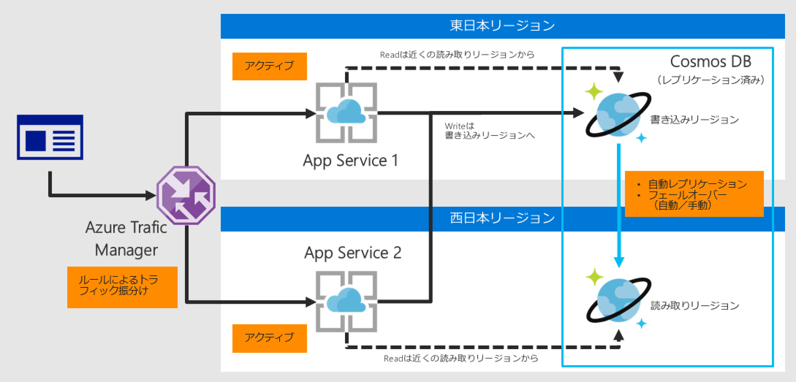
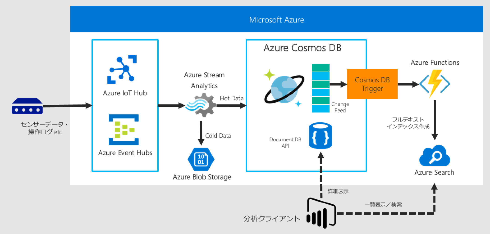

# Azure Cosmos DBを使った高速分散アプリケーションの設計パターン - Demo用プロジェクト

このリポジトリは、2017年11月9日に実施されたMicrosoft Tech Summitのセッション[Azure Cosmos DB を使った高速分散アプリケーションの設計パターン](https://www.slideshare.net/kazuyukimiyake/azure-cosmos-db-81795518)で行ったデモのソースコードです。

## Demo1: Visual StudioによるJSONからクラスの生成

```Documents```プロジェクトの```Person```クラスにコピーしたJSONを自由に貼り付けて下さい。

JSON構造に合わせたクラスが生成出来ればOKです。

## Demo2: PreferredLocationsを設定したMVCアプリによるCosmos DBへの読み取りリージョンアクセス

Demo2は以下のようなDR構成を実現する際のCosmos DBとApp Serviceの組み合わせを実装する際のソースコード例です。

このDemoを実行するには、リポジトリ内の```PreferredLocations```プロジェクトを利用します。



以下の手順でAzure Cosmos DBのコレクションを作成して下さい。
1. Cosmos DBの新規データベースアカウントを作成
1. クイックスタートから任意のプラットフォームを選択し、「Itemsコレクションの作成」を実行します
1. アプリをダウンロードして適当にTodoデータを追加して下さい


Cosmos DBのリージョン追加  
ポータルの「データをグローバルにレプリケートする」から、任意のリージョンを追加して下さい。

次にAzure AppService(WebApp)のインスタンスをCosmos DBのリージョン毎に同じリージョンに1ずつ作成して下さい。プランはフリーでも大丈夫です。

WebAppのアプリケーション設定には以下のKey-Valueを設定しておいてください。

* "Endpoint": "{Cosmos DBのエンドポイント}",
* "Key":"{Cosmos DBのアクセスキー}",
* "DatabaseId": "{Cosmos DBのデータベースID}",
* "CollectionId": "Items",
* "AppRegion": "{このWeb Appをデプロイしているリージョン名（Japan Eastなど）}"

VisualStudioで```PreferredLocations```を各リージョンのWebAppにデプロイして下さい。

デプロイ後、アプリを実行すると、画面に書き込みリージョンと読み取りリージョンのURLが表示されます。

手動フェールオーバーを行うと、リージョンが切り替わることを確認できます。

---

## Demo3: Azure Functions Cosmos DB Triggerを使ったリアルタイムデータ分析

Demo3は以下のようなリアルタイムデータ分析環境を構築するためのソースコード例です。



このDemoを実行するには、リポジトリ内の```EventSender```と```TodoMonitor```プロジェクトを利用します。

（実行手順は作成中）
